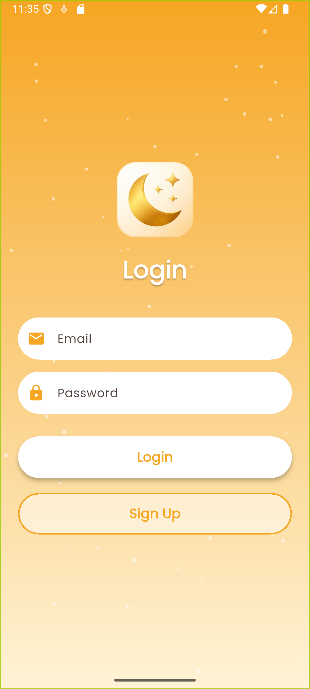
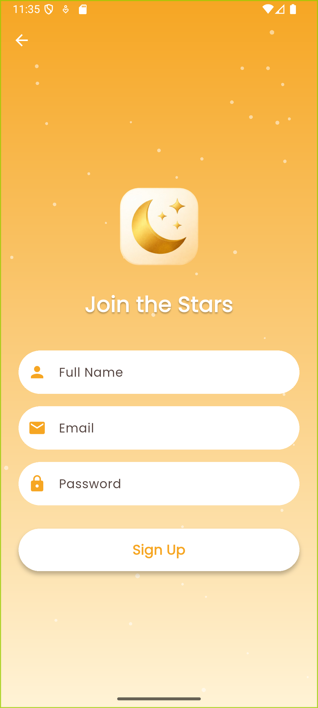
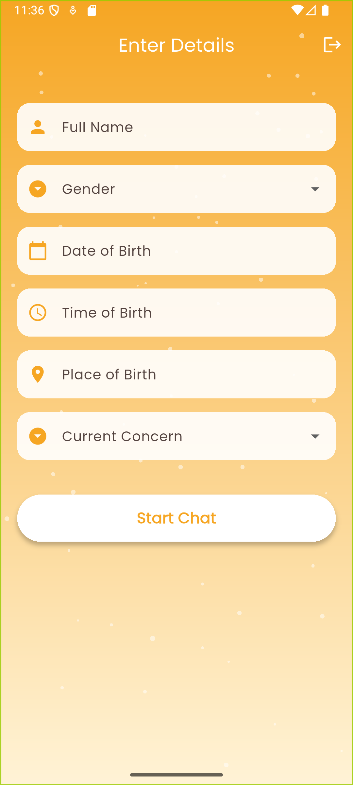
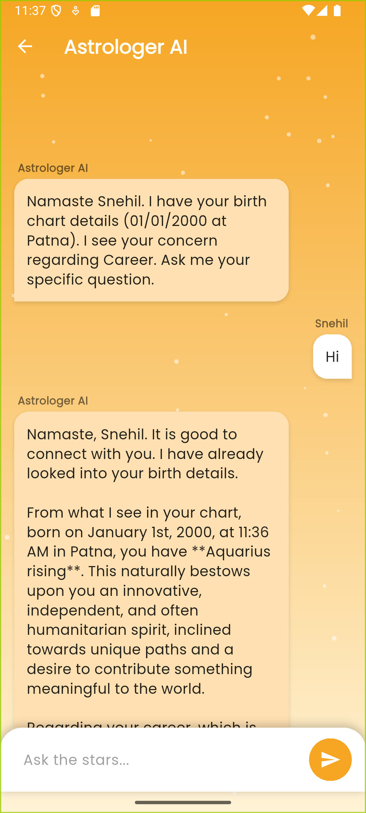

🌟 Astro Chatbot – Flutter Intern Task

Astro Chatbot is a Flutter-based astrology chatbot application where users log in using email and password, submit their birth details, and chat with an AI-powered astrologer that responds in a calm, spiritual, Vedic tone.

This project was developed as part of a Flutter Intern Assignment to demonstrate UI development, form validation, state handling, and AI API integration.

## 📱 Screenshots

📌 Images are stored in the `assets/` folder of this repository.

### Authentication Screens

| Login | Signup |
|------|--------|
|  |  |

---

### Application Screens

| Astrology Details Form | Astrologer Chat |
|----------------------|----------------|
|  |  |

## 🎥 Video Demo

A short video demonstration of the application showcasing:
- Authentication flow (Login / Signup)
- Astrology details form submission
- AI astrologer chat interaction

📌 **Google Drive Link:**  
https://drive.google.com/file/d/1mZ1WJ4I634WBDh9CW2eNtdNSUCWeVR35/view?usp=sharing

🎯 Objective

Collect basic user and birth details

Start a chatbot session with an AI astrologer

Demonstrate clean Flutter UI, state handling, and API usage

🔄 User Flow

User opens the app

Login / Signup using Email & Password

Fill Astrology Details Form

Tap Start Astrology Chat

Chat with AI Astrologer

✨ Features
🔐 Authentication (Mandatory)

Email & Password Login / Signup

Firebase Authentication

Auto-redirect based on authentication state

📝 Astrology Details Form (Mandatory)

Form Fields

Full Name

Gender

Date of Birth (DD/MM/YYYY)

Time of Birth (HH:MM AM/PM)

Place of Birth (City, State, Country)

Current Concern (Dropdown):

Career

Marriage

Love

Health

Finance

General

✔ All fields are validated before proceeding.

💬 Astrologer Chat Interface (Mandatory)

Left-aligned AI messages

Right-aligned user messages

Typing indicator while AI is responding

Auto-scroll to the latest message

Astrologer Persona

Calm, wise, and spiritual tone

Uses astrology terminology (kundli, graha, dasha, lagna)

Friendly and respectful

Never reveals that it is an AI

🤖 AI Integration

Google Gemini API

REST API integration using http

Sends user messages to AI

Displays AI responses in chat UI

Basic error handling for API failures

🛠️ Tech Stack

Framework: Flutter (Dart)

UI: Material 3

Authentication: Firebase Auth

AI API: Google Gemini

Networking: http

State Management: setState, StreamBuilder

Environment Variables: flutter_dotenv

Fonts: google_fonts

🚀 Getting Started
Prerequisites

Flutter SDK (>= 3.0.0)

Firebase Project

Google Gemini API Key

1️⃣ Clone Repository
git clone https://github.com/Snehil208001/Astro-Chatbot-App
cd astrochatbot

2️⃣ Install Dependencies
flutter pub get

3️⃣ Firebase Setup

Create a Firebase project

Enable Email/Password Authentication

Add configuration files:

android/app/google-services.json

ios/Runner/GoogleService-Info.plist

4️⃣ Environment Variables

Create a .env file in the root directory:

API_KEY=your_gemini_api_key_here

⚠️ Do NOT commit the .env file

5️⃣ Run the App
flutter run

📂 Project Structure
lib/
├── main.dart                 # App entry point & auth gate
├── screens/
│   ├── login_screen.dart     # Login UI
│   ├── signup_screen.dart    # Signup UI
│   ├── home_screen.dart      # Astrology details form
│   └── chat_screen.dart      # AI chat logic
└── widgets/
    └── astro_background.dart # Reusable background UI
assets/
├── login.png
├── signup.png
├── homescreen.png
└── chatscreen.png

✅ MVP Checklist (Task Requirements)

 Email + Password Login

 Astrology Details Form with Validation

 AI Astrologer Chat UI

 AI API Integration

 Clean & Runnable Flutter Project

🔮 Future Enhancements (Optional)

Kundli / Birth chart visualization

Chat history persistence

Multi-language support (Hindi / English)

Daily horoscope

Premium chat features

📌 Notes

Backend and chat persistence are optional as per task scope

Focus is on clean UI, logic, and readable code

Over-engineering intentionally avoided

👨‍💻 Developed By

Snehil
Flutter Developer
Internship Submission
